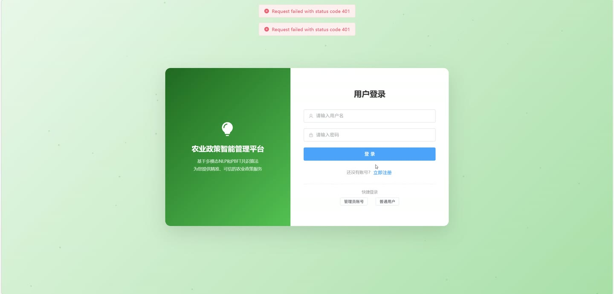
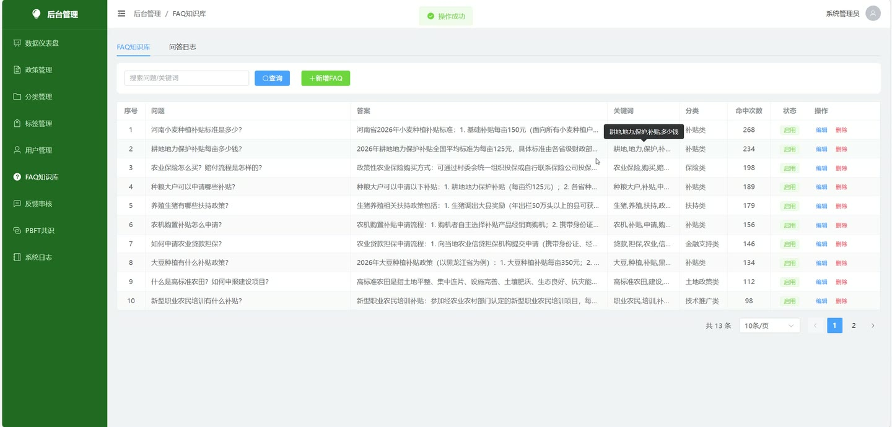
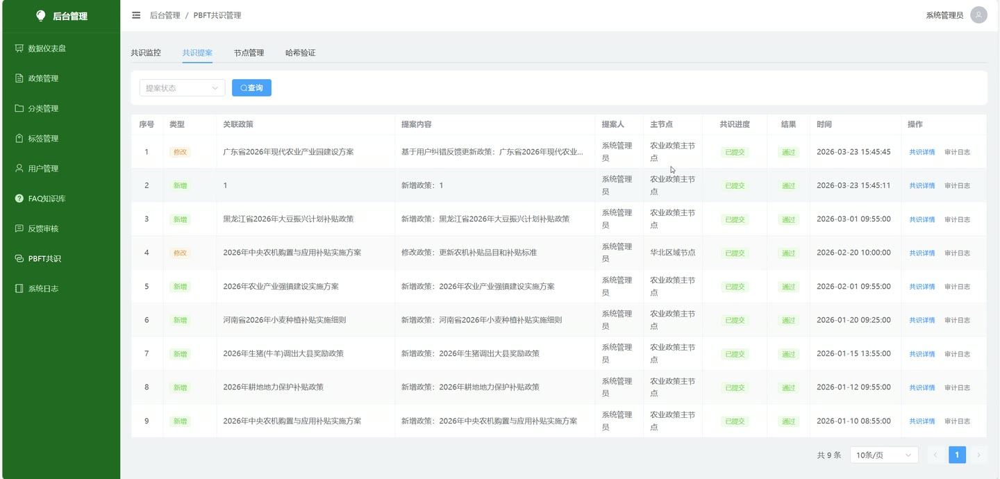
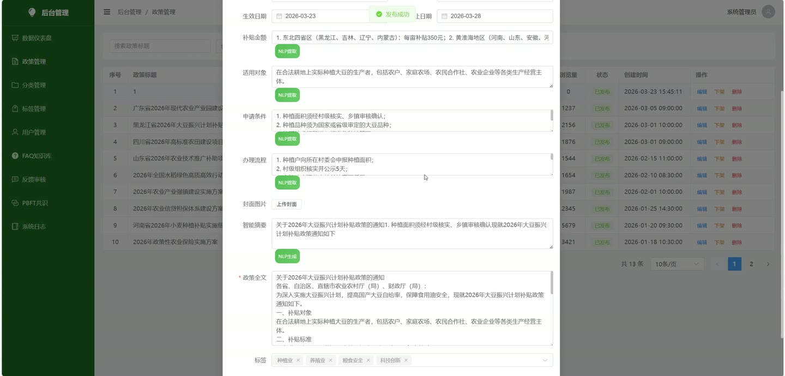
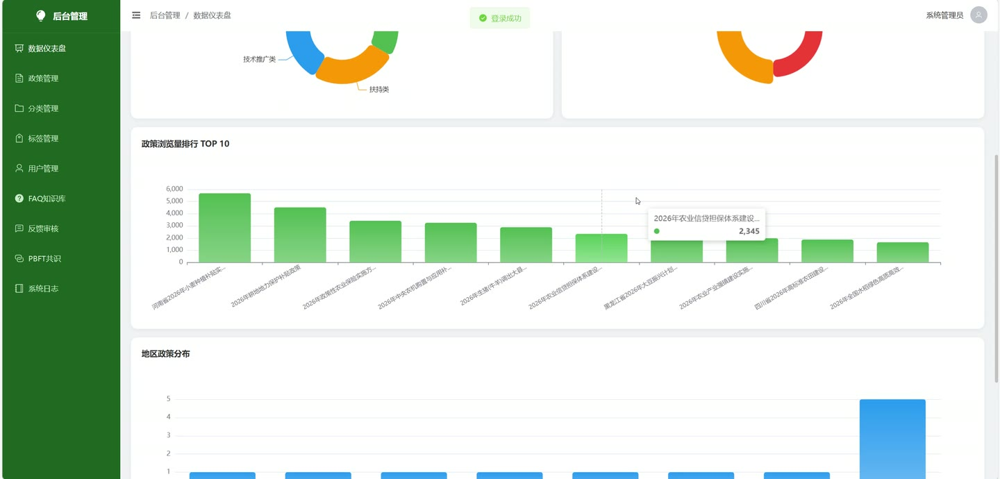
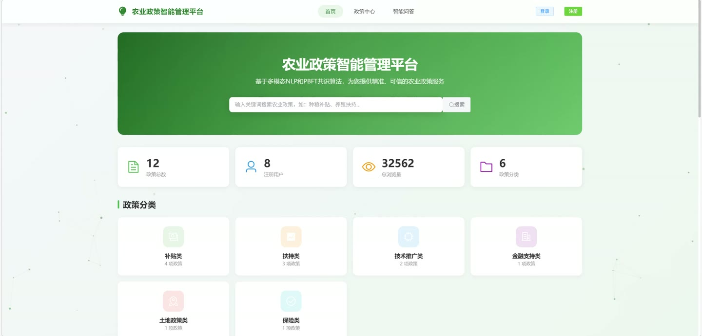

# (附文档)Springboot3+Vue3+MySQL 基于多模态 NLP 和 PBFT 的农业政策智能管理平台

**技术栈**：Springboot3、Vue3、MySQL

### 系统简介

本系统是一个基于 Springboot3 + Vue3 + MySQL 的农业政策智能管理平台，采用前后端分离架构。平台集成了多模态 NLP 文本解析引擎与 PBFT 拜占庭容错共识算法，实现了从政策发布、智能解析、防篡改验证到用户互动反馈的全流程闭环管理。系统包含普通用户端和管理员端两大角色。
 
### 核心功能
 
### 普通用户端

 
- 浏览政策列表：支持按分类、地区、政策级别、关键词进行筛选查询 
- 查看政策详情：展示政策标题、摘要、正文内容、分类、标签、补贴金额、适用对象、申请条件、办理流程、生效日期与截止日期 
- 智能搜索政策：输入自然语言查询，系统基于 NLP 分词和关键词匹配返回相关结果 
- 发表政策评论：登录后可在政策详情页发表评论 
- 收藏/取消收藏政策：一键切换收藏状态，在个人中心查看收藏列表 
- 提交政策反馈纠错：对政策内容提交反馈（标题、描述），等待管理员审核 
- 验证政策防篡改：查看政策当前内容哈希值与 PBFT 共识存储的哈希值是否一致 
- 智能问答：输入问题，系统匹配 FAQ 知识库返回答案，记录问答历史 
- 个人中心管理：修改昵称、手机号、邮箱等个人信息；修改登录密码；上传头像 
- 政策订阅管理：添加订阅（选择分类、地区、关键词），取消订阅 
- 站内消息管理：查看消息列表、标记单条已读、全部标记已读、查看未读消息数量 
- 查看问答历史：分页查看自己的智能问答记录 
- 用户注册与登录：支持新用户注册和账号密码登录
 
### 管理员端

 
- 政策管理：分页查询政策列表（支持按关键词/状态筛选）；查看政策详情；发布新政策（填写标题、内容、摘要、分类、标签、发布单位、适用地区、政策级别、补贴金额、适用对象、申请条件、办理流程、封面图、生效日期、截止日期）；修改政策；上下架政策；删除政策 
- 上传政策文件并自动解析：上传 TXT 或 DOCX 文件，系统自动提取摘要、关键词、补贴金额、适用对象、申请条件、办理流程等结构化信息 
- 上传政策封面图片和附件：上传图片到 covers 目录，上传附件到 attachments 目录 
- 政策分类管理：分页查询分类列表（支持关键词搜索）；新增、修改、删除分类；查看所有启用分类 
- 政策标签管理：分页查询标签列表（支持关键词搜索）；新增、修改、删除标签；查看所有标签 
- 用户管理：分页查询用户列表（排除管理员）；查看用户详情；修改用户状态（启用/禁用）；删除用户 
- 反馈纠错审核：分页查询用户提交的反馈列表（支持按关键词/状态筛选）；查看反馈关联的政策详情；采纳反馈（编辑政策内容后触发 PBFT 共识，共识通过后更新政策并标记已采纳）；驳回反馈（填写回复理由）；删除反馈 
- FAQ 知识库管理：分页查询 FAQ 列表（支持按关键词搜索）；新增、修改、删除 FAQ（问题、答案、关键词）；查看智能问答日志 
- PBFT 共识管理：查看共识监控总览（提案总数、成功/失败/待处理数量、成功率、节点总数/活跃/故障数、共识日志总数、提案类型分布）；查看提案列表（按状态筛选）；查看提案详情（展示预准备/准备/提交三阶段各节点响应矩阵，包含节点名称、是否响应、响应消息、时间、哈希值）；查看节点列表；更新节点状态；验证政策哈希（对比当前内容哈希与存储哈希）；为单个政策初始化哈希值；批量初始化所有未记录哈希的政策 
- 系统日志管理：分页查询操作日志（支持按关键词/用户名筛选） 
- 数据统计与可视化：查看总览统计数据（政策数、用户数、问答量、评论量、提案数、总浏览量）；查看政策分类分布（饼图数据）；查看政策级别分布（饼图数据）；查看政策浏览量排行（柱状图数据，TOP10）；查看地区政策分布（柱状图数据）
 
### 技术栈

 后端框架Spring Boot 3 ORMMyBatis-Plus 权限认证Spring Security 前端框架Vue 3 状态管理Pinia 构建工具Vite 数据库MySQL 文件解析Apache POI (TXT/DOCX)
 
### 交付内容

 
- 后端完整源码 
- 前端完整源码 
- 数据库初始化脚本 
- 万字文档

## 界面展示

---

## 获取完整源码 + 万字文档

本仓库为项目介绍页。**完整前后端源码、数据库初始化脚本、万字项目文档**，请加微信 `kangkangcode`，或访问 [codekk.top](http://codekk.top) 获取。

可作课程设计 / 毕业设计参考，支持远程部署调试。